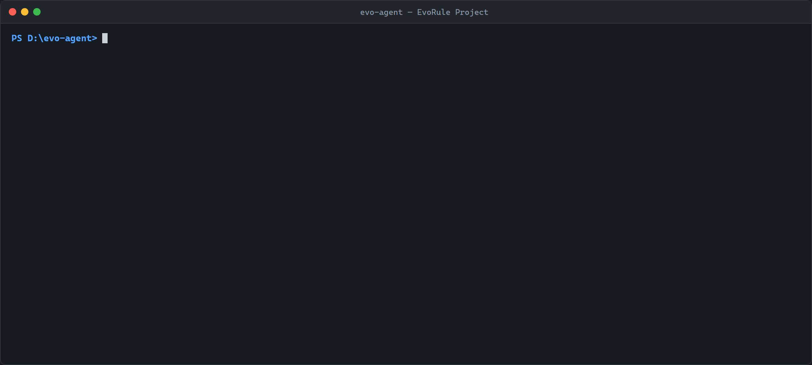

# Evo-Agent

> 可信 AI 工作站 —— 在 evorule 确定性执行引擎之上，为开发者和企业提供基于规则约束的 AI Agent 编排层。

[](https://github.com/evorule/evo-agent/actions/workflows/ci.yml)
[](https://www.rust-lang.org)
[](LICENSE)
[](Cargo.toml)

---

## 定位

**Evo-Agent = LLM 大脑 + 工具手脚 + 持久记忆 + 规则约束，执行过程通过 evorule 引擎留下可审计的 Fact 链。**

它不重新发明状态机，也不内嵌 LLM 客户端。所有 LLM 调用、工具调用、记忆读写都转成 evorule 的 `IoRequest` 事件，由 evorule 反应器负责执行、回滚、审计 —— Agent 层只关心"下一步该干什么"。

### 三种 AI 角色

| 角色 | 说明 | 对应 Agent |
|------|------|------------|
| **规则创建助手** | 自然语言 → JSON 规则（LLM 生成 + G1-G7 校验 + 热重载） | `rule-copilot` |
| **AI 执行器** | 通过 `call_external` 执行 LLM/工具调用，受规则约束 | `general` / `researcher` |
| **对话管理入口** | 自然语言管理规则生命周期（创建/提交/激活/归档） | `rule-copilot` |

### 30 秒看一眼



*真实终端录制：`evo-agent list` / `tools show` / `validate` / `tools list` —— 6 个内置工具的 3 层安全模型（active 白名单 / candidate 待批 / blocked 永不）。*

---

## 核心特性

| 特性 | 说明 |
|------|------|
| **完整 Fact 闭环** | 每次 LLM 调用、工具调用、记忆读写都生成可审计 Fact，支持 rewind / replay / diff |
| **三层记忆** | 共享记忆（`shared.{ns}.{key}`）/ 会话记忆 / 短期消息，跨会话可追溯 |
| **跨会话共享事实** | `SharedFactsLog` WAL 持久化 + rollup 标记 + 按 ID 审计回溯 |
| **记忆事件链** | 结构化事件提取 + 因果链 + 确定性回放（`replay` 命令） |
| **会话沉淀** | 会话结束时自动写入摘要 + 稳定事实到共享空间 |
| **工具注册中心** | `ToolRegistry` + `ToolFunction` trait，任何 `async fn(JsonValue) -> Result<JsonValue, String>` 都能注册 |
| **3 层安全模型** | active（白名单）/ candidate（待批）/ blocked（永不），含 SSRF 防护 + 工作目录沙箱 |
| **规则管理工具集** | 34 个工具：workspace 2 + rule 12 + translate 3 + audit 3 + sandbox 5 + dataset 2 + publish 5 + production 2 |
| **工作流引擎** | DAG 拓扑编排多 Agent，同层并行 + 跨层串行 + 模板渲染 |
| **MCP 客户端** | 接入 Model Context Protocol 工具生态（stdio 传输） |
| **上下文窗口管理** | 按 token 数裁剪历史消息，保留 system + 最近若干轮 |
| **审批系统** | CLI 交互审批 / HTTP 回调审批 / 自动批准三种模式 |
| **HTTP + WebSocket + SSE** | REST API 启动 Agent，SSE 流式输出，WebSocket 双向通信 |
| **REPL 交互模式** | 对话式复用同一 session，支持 `/rewind` 回滚 |
| **可插拔 LLM/工具** | `LlmHandler` / `ToolHandler` trait，接入 OpenAI / MiniMax / DeepSeek 等 |
| **零 unsafe** | `#![forbid(unsafe_code)]` 全栈适用 |

---

## 架构：2-Loop 解耦

Evo-Agent 是独立的应用层，通过 HTTP API 与 evorule 引擎对话：

```
┌──────────────────────────────┐         ┌──────────────────────────────┐
│  Evo-Agent (应用层)           │         │  evorule-server (机制层)      │
│                              │         │                              │
│  ┌──────────────────────┐    │         │  ┌──────────────────────┐    │
│  │  Application Loop    │    │         │  │  Reactor Loop        │    │
│  │                      │    │         │  │                      │    │
│  │  for step in 0..N:   │    │         │  │  drain command       │    │
│  │    LLM call  ───┐    │    │  HTTP   │    │  stable detect       │    │
│  │    parse resp   │    │    │ ──────> │    │  block on cmd_rx     │    │
│  │    handle io_   │    │    │ <────── │    │  while pending_io=0: │    │
│  │      request    │    │    │   SSE   │    │    execute_transition│    │
│  │    POST io_resp │    │    │         │    │                      │    │
│  └──────────────────────┘    │         │  └──────────────────────┘    │
│           ▲                  │         │           │                  │
│           │                  │         │           ▼                  │
│  ┌────────┴─────────┐        │         │  ┌──────────────────────┐    │
│  │ MemoryManager    │        │         │  │ FactsLog (append)    │    │
│  │ ToolRegistry     │        │         │  │ + causal chain       │    │
│  │ AgentDefinition  │        │         │  │ + WAL + SharedFacts  │    │
│  │ ContextWindow    │        │         │  └──────────────────────┘    │
│  │ WorkflowEngine   │        │         │                              │
│  │ McpClient        │        │         │                              │
│  └──────────────────┘        │         │                              │
└──────────────────────────────┘         └──────────────────────────────┘
```

**为什么分开？** 把"机制"和"应用"塞进同一个进程，会导致确定性、可审计性、可形式化验证的边界污染。EvoRule 的 TCB 永远只做加减与因果链，EvoAgent 的所有业务逻辑都在它之外。HTTP 是它们的唯一契约。

---

## 快速开始

### 前置条件

- Rust 1.74+
- 运行中的 evorule-server（默认 `http://127.0.0.1:18080`）
- LLM provider 的 API key

### 5 分钟 Demo（一条命令）

准备一个 MiniMax API key（或 DeepSeek），然后：

```bash
# Windows (PowerShell)
$env:MINIMAX_API_KEY = "your-api-key"
powershell -ExecutionPolicy Bypass -File demo.ps1

# Linux / macOS
export MINIMAX_API_KEY=your-api-key
./demo.sh
```

脚本自动完成：下载并启动 evorule-server（Gitee Release 整包，端口 18080，随机 token 认证）→ 写入项目配置 → 构建 → 跑一笔费用登记会话（LLM + 工具调用全部转为可审计 Fact）→ 调用 `audit/verify` 验证 Fact 哈希链并打印完整审计报告。完成后浏览器打开 http://localhost:18080 可查看审计页。重置：删除 `.demo/` 目录即可。

### 依赖契约

evorule 核心库（`evorule-tcb` / `evorule-reactor`）以 **crates.io 版本依赖**引用——clone 本仓后直接构建，无需并排检出主仓：

```bash
git clone https://gitee.com/evorule/evo-agent.git
cd evo-agent
cargo build          # 依赖自动从 crates.io 解析
```

- **禁止 path 依赖回流**：引擎 crate 一旦改回本地 path 引用，仓外构建即失效；
  `verify.ps1` 第 4 步（依赖契约断言）会在发现 path 依赖时判 FAIL。
- 运行时仍需一个可达的 evorule-server 实例（见下节）。

### 启动 evorule-server

```bash
cd ../evorule-server
cargo build --release

# 基础启动（审计 / 记忆 / 时间机器 / 规则热重载）
./target/release/evorule-server --addr 127.0.0.1:18080 --wal-dir ./data/wal

# 若需 rule-copilot / general / researcher 通过 call_external 调用外部服务，
# 必须额外挂载服务注册表并放行本机回环（详见 evorule-server/README.md）：
./target/release/evorule-server --addr 127.0.0.1:18080 --wal-dir ./data/wal \
  --service-registry ./service_registry.json --allow-loopback
```

> 角色 1/3（`call_external`）在 evorule-server 侧已就绪：挂载 `service_registry.json` 后即可跑通。仓库内置 `echo_server.py` + `dev-start.sh` 演示环境，参考 evorule-server 实战指南。

### 启动 Evo-Agent HTTP API

```bash
cargo run --release -- serve --port 8081
```

### 跑一个 Agent

```bash
curl -X POST http://127.0.0.1:8081/api/agent/run \
  -H "Content-Type: application/json" \
  -d '{"agent_type": "researcher", "goal": "总结当前目录的 README"}'
```

---

## CLI 用法

```text
evo-agent run <goal>                    # 跑 agent（给一个 goal + 可选 agent 类型）
evo-agent list                           # 列出 agents/ 目录下的所有 agent
evo-agent tools list                     # 列出 6 个内置工具（3 层安全模型）
evo-agent tools show <name>              # 显示单个工具的 active/candidate/blocked 详情
evo-agent validate <agent>               # 校验 agent.json 是否合法
evo-agent config                         # 显示合并后的配置
evo-agent serve --port 8081              # 启动 HTTP server
evo-agent workflow <workflow_id>         # 执行多 agent DAG 工作流
evo-agent repl                           # REPL 交互模式（复用同一 session）
evo-agent replay --session <id>          # 回放 session 的记忆事件链
```

### run

```bash
# 用 researcher agent 跑任务
MINIMAX_API_KEY=sk-... \
  evo-agent run "总结一下 README" -a researcher

# 流式输出（token-by-token）
evo-agent run "分析代码结构" -a researcher --stream

# 自动批准 candidate 工具
evo-agent run "执行构建脚本" -a general --auto-approve-candidates
```

### repl

```bash
evo-agent repl -a general
# > 帮我查看当前目录结构
# > /session        # 显示当前 session ID
# > /rewind 3       # 回滚到版本 3
# > /exit
```

### replay

```bash
# 回放全部事件（按时间线）
evo-agent replay --session 123

# 从 E005 沿因果链回溯
evo-agent replay --session 123 --event E005

# 回放某实体的所有事件
evo-agent replay --session 123 --entity pet_doudou

# LLM 自然语言叙述（temperature=0，事实不变）
evo-agent replay --session 123 --narrate
```

### workflow

```json
// rules/workflows/research_and_write.json
{
  "workflow_id": "research_and_write",
  "nodes": [
    { "id": "research", "agent_type": "researcher", "task": "调研 Rust 异步生态", "depends_on": [] },
    { "id": "write", "agent_type": "general", "task_template": "基于调研结果写报告：\n{research}", "depends_on": ["research"] }
  ],
  "output_node": "write"
}
```

```bash
evo-agent workflow research_and_write
```

---

## Agent 定义

Agent 配置从 `agents/{type}.json` 加载：

```json
{
  "agent_type": "researcher",
  "version": "0.1.0",
  "description": "研究型 Agent",
  "system_prompt": "You are a careful research assistant.",
  "model": "MiniMax-M2.5",
  "temperature": 0.3,
  "max_steps": 20,
  "step_timeout_secs": 60,
  "tools": ["file_read", "search_files", "file_list"],
  "memory": {
    "type": "persistent",
    "namespace": "researcher",
    "message_persist": { "mode": "every_message" },
    "max_session_summaries": 3,
    "max_injected_events": 5,
    "enable_event_extraction": true
  },
  "context_window_tokens": 8192,
  "parallel_tools": 1
}
```

### 内置 Agent

| Agent | 说明 | 工具 |
|-------|------|------|
| `general` | 通用 Agent — 文件操作 + Shell + Web | file_read, file_list, file_write, search_files, shell_exec, http_get |
| `researcher` | 研究 Agent — 只读搜索 | file_read, search_files, file_list |
| `rule-copilot` | 规则协作 Agent — 34 个规则管理工具 | ws_*, rule_*, audit_*, translate_*, sandbox_*, dataset_*, publish_* |

---

## 记忆系统

### 三层记忆

| 层级 | 路径格式 | 用途 | 生命周期 |
|------|----------|------|----------|
| 共享记忆 | `shared.{ns}.{key}` | 跨会话共享知识 | 永久（WAL 持久化） |
| 会话记忆 | `{ns}.sessions.{sid}.{key}` | 单会话私有状态 | 会话期间 |
| 短期消息 | `{ns}.sessions.{sid}.messages.{idx}` | 对话历史 | 会话期间 |

所有记忆通过 `POST /api/sessions/{id}/payload` 写入 evorule，记忆本身就是 Fact，可回放、可审计。

### 跨会话共享事实

当 session 写入 `shared.*` 路径的 PayloadUpdate 时，evorule-server 同步广播到 `SharedFactsLog`：

- **WAL 持久化**：重启后自动恢复历史共享事实 + 元数据
- **Rollup 标记**：已合并的旧事实从 prefix 查询中过滤，但 `fact_by_id` 仍可访问（审计可追溯）
- **来源追踪**：每条共享事实记录 `source_session_id`

### 记忆事件链

会话运行期间，`EventExtractor` 从对话中提取结构化事件：

- 实体（Entity）：人物、地点、物品等
- 事件（Event）：带因果链的 `cause_fact_id` 锚点
- 叙事（Narrative）：LLM 生成的自然语言描述

会话结束时通过 `replay` 命令回放，支持按事件 ID、实体、方向（backward/forward）筛选。

### 会话沉淀

会话结束（Stable/Error 分支）时自动完成三级沉淀：

1. **当前级**：messages 已由 `MessagePersistMode` 在运行时逐条写入
2. **中期级**：整会话摘要写入 `shared.{ns}.sessions.{sid}.summary`
3. **长期级**：稳定事实写入 `shared.{ns}.stable.{key}`

---

## 工具系统

### 3 层安全模型

| 层级 | 行为 | 示例 |
|------|------|------|
| **ACTIVE** | 直接执行，无需审批 | file_read, file_list, file_write, search_files, shell_exec（8 命令白名单）, http_get（6 主机白名单） |
| **CANDIDATE** | LLM 想用 → 返回 proposal → 用户审批 → 执行 | rm, mv, curl 等 20+ shell 命令，任意公开 HTTP host |
| **BLOCKED** | 永不批准 | sudo, python, bash 等 28+ 逃逸命令，SSRF 黑名单 IP 段 |

### 内置工具（6 个）

| 工具 | 说明 |
|------|------|
| `file_read` | 读取文件（工作目录沙箱，拒绝 `..` / 绝对路径 / symlink 逃逸） |
| `file_list` | 列出目录内容 |
| `file_write` | 写入文件 |
| `search_files` | 按内容搜索文件 |
| `shell_exec` | 执行 Shell 命令（白名单 + candidate 审批） |
| `http_get` | HTTP GET 请求（主机白名单 + SSRF 防护） |

### 规则管理工具集（34 个）

通过 `rule_management_toolkit` / `full_rule_toolkit` 组装，用于 `rule-copilot` Agent：

| 类别 | 工具数 | 说明 |
|------|--------|------|
| workspace | 2 | ws_list, ws_create |
| rule | 12 | rule_list, rule_get, rule_create, rule_update, rule_versions, rule_version_get, rule_submit, rule_activate, rule_block, rule_archive, rule_fork, rule_reload |
| translate | 3 | rule_to_transform, rule_to_conditional, rule_validate |
| audit | 3 | audit_get, audit_verify, session_rewind |
| sandbox | 5 | 沙盒编排（fork + 合成数据 + 测试报告） |
| dataset | 2 | 数据集管理 |
| publish | 5 | 发布队列 + 三级权限 |
| production | 2 | 生产环境管理 |

### MCP 工具接入

通过 MCP 客户端接入外部工具生态：

```toml
# evo-agent.toml
[[mcp.servers]]
name = "filesystem"
command = "npx"
args = ["-y", "@modelcontextprotocol/server-filesystem", "/tmp"]
```

MCP 工具自动注册为 `mcp_{server}_{tool}` 前缀，纳入 ToolHandler 统一管理。

---

## 配置

4 层配置加载（优先级低 → 高，后者覆盖前者）：

1. **默认值** — 代码中 `Config::default()`
2. **用户配置** — `~/.config/evo-agent/config.toml`（Linux/macOS）或 `%APPDATA%\evo-agent\config.toml`（Windows）
3. **项目配置** — `./evo-agent.toml`
4. **环境变量** — `EVO_AGENT_*` 前缀，`__` 分隔 section/field

```toml
# evo-agent.toml 示例
[llm]
provider = "minimax"
api_key = "${ENV:MINIMAX_API_KEY}"
model = "MiniMax-M2.5"
api_base = "https://api.minimax.io/v1/text/chatcompletion_v2"
timeout_secs = 30
max_retries = 3
context_window_tokens = 8192

[evorule]
base_url = "http://127.0.0.1:18080"

[agents]
dir = "./agents"
default = "general"

[serve]
host = "127.0.0.1"
port = 8081
```

`api_key` 字段支持 `${ENV:VAR_NAME}` 占位符，加载时展开为环境变量值。

---

## HTTP API

### Evo-Agent 自有 API

| 方法 | 路径 | 说明 |
|------|------|------|
| `GET` | `/api/agent/list` | 列出所有已注册 Agent 类型 |
| `GET` | `/api/agent/{type}` | 查看指定 Agent 详细定义 |
| `POST` | `/api/agent/run` | 启动一个 Agent 运行 |
| `GET` | `/api/health` | 健康检查 |

### 通过 ApiCore 透传到 evorule-server

两个 client（`EvoruleApiClient` + `WorkspaceApiClient`）共享 `ApiCore`（base_url + reqwest Client + Bearer auth），统一错误为 `ApiError`。

认证 token 构造时读取：`EVORULE_SERVICE_TOKEN`（service 身份，可写受保护域 `stable.llm`/`stable.system`）优先，缺省回退 `EVORULE_AUTH_TOKEN`（user 身份）；均缺失时不发 auth header（server 须为 dev mode）。

---

## 接入真实 LLM

实现 `LlmHandler` trait 即可接入任意 LLM provider：

```rust
use evo_agent::io_handlers::LlmHandler;
use async_trait::async_trait;
use serde_json::{json, Value};

pub struct OpenAIHandler {
    api_key: String,
    base_url: String,
}

#[async_trait]
impl LlmHandler for OpenAIHandler {
    async fn call(
        &self,
        model: &str,
        system_prompt: &str,
        messages: Vec<Value>,
        tools: Vec<Value>,
    ) -> Result<Value, String> {
        let client = reqwest::Client::new();
        let body = json!({
            "model": model,
            "messages": [
                { "role": "system", "content": system_prompt },
                ...messages,
            ],
            "tools": tools,
        });
        let resp = client
            .post(&format!("{}/chat/completions", self.base_url))
            .bearer_auth(&self.api_key)
            .json(&body)
            .send()
            .await
            .map_err(|e| e.to_string())?
            .json::<Value>()
            .await
            .map_err(|e| e.to_string())?;
        Ok(resp)
    }
}
```

内置支持 OpenAI 兼容 API（MiniMax / DeepSeek / OpenAI），通过 `LlmConfig` 配置 provider / api_key / model / api_base。

---

## 测试

```bash
# 单元 + 集成测试
cargo test --workspace

# 只跑集成（mockito mock evorule-server）
cargo test --test integration_test

# 真实 evorule-server 端到端
# 1. 启动 evorule-server
# 2. cargo test -- --ignored --test-threads=1
```

集成测试用 `mockito` mock evorule-server，覆盖：
- `auto_recall`（启动时拉取 shared facts）
- ReAct 主循环的 SSE 事件驱动
- 工具调用闭环
- 错误处理路径

---

## 目录结构

```
evo-agent/
├── Cargo.toml
├── README.md
├── CHANGELOG.md
├── LICENSE
├── NOTICE.md                        # 许可与依赖声明
├── verify.ps1                       # 一键验证（build/test/防泄漏/布局断言）
├── agents/                          # Agent 定义
│   ├── general.json
│   ├── researcher.json
│   └── rule-copilot.json
├── config-examples/                 # 配置示例
├── docs/
│   ├── API.md
│   ├── RELEASE_PROCESS.md           # 发布流程
│   └── security/                    # 安全设计文档
├── src/
│   ├── lib.rs                       # 入口 + 公共契约面登记
│   ├── config.rs                    # 4 层配置加载
│   ├── json_convert.rs              # serde ↔ tcb::JsonValue 转换
│   ├── io_handler.rs                # I/O handler 基类 trait
│   ├── io_dispatcher.rs             # I/O 分发器
│   ├── agent/
│   │   ├── runner.rs                # ReAct 主循环
│   │   ├── audited_llm.rs           # 审计链内 LLM 执行桥（sidecar 会话协议）
│   │   ├── memory.rs                # 三层记忆管理
│   │   ├── memory_event/            # 结构化记忆事件 + 因果链 + 回放
│   │   │   ├── entity.rs            #   实体定义
│   │   │   ├── event.rs             #   事件定义
│   │   │   ├── evidence.rs          #   证据伴随
│   │   │   ├── extraction.rs        #   事件提取
│   │   │   ├── replay.rs            #   确定性回放
│   │   │   └── store.rs             #   事件存储
│   │   ├── definition.rs            # Agent 配置加载
│   │   ├── tool_registry.rs         # 工具注册中心
│   │   ├── translator.rs            # LLM 响应解析
│   │   ├── delegate.rs              # Agent 嵌套上下文
│   │   ├── workflow.rs              # DAG 工作流引擎
│   │   ├── context_window.rs        # 上下文窗口裁剪
│   │   ├── summarizer.rs            # 会话摘要
│   │   ├── sediment.rs              # 会话沉淀通道
│   │   ├── approval.rs              # 工具审批系统
│   │   ├── callback.rs              # 事件回调链
│   │   ├── output_validator.rs      # JSON Schema 输出校验
│   │   └── mod.rs
│   ├── api/
│   │   ├── api_core.rs              # 共享 HTTP 基建（ApiCore + ApiError）
│   │   ├── evorule_client.rs        # evorule-server 端点客户端
│   │   ├── workspace_client.rs      # workspace 服务客户端
│   │   ├── agent_api.rs             # /api/agent/* 路由
│   │   ├── serve_tools.rs           # serve 模式工具注册
│   │   ├── ws_handler.rs            # WebSocket 双向流
│   │   ├── auth.rs                  # Bearer 认证
│   │   ├── metrics.rs               # Prometheus 指标
│   │   └── mod.rs
│   ├── builtin_tools/               # 6 个内置工具
│   │   ├── file_read.rs
│   │   ├── file_list.rs
│   │   ├── file_write.rs
│   │   ├── search_files.rs
│   │   ├── shell_exec.rs
│   │   ├── http_get.rs
│   │   ├── delegate_tool.rs         # Agent 委托工具
│   │   └── mod.rs
│   ├── rule_tools/                  # 34 个规则管理工具
│   │   ├── workspace_tools.rs       #   workspace 2 个
│   │   ├── rule_tools.rs            #   rule CRUD 12 个
│   │   ├── translate_tools.rs       #   规则转换 3 个
│   │   ├── audit_tools.rs           #   审计 3 个
│   │   ├── sandbox_tools.rs         #   沙盒 5 个
│   │   ├── dataset_tools.rs         #   数据集 2 个
│   │   ├── publish_tools.rs         #   发布 5 个
│   │   ├── production_tools.rs      #   生产 2 个
│   │   └── mod.rs
│   ├── mcp/                         # MCP 客户端
│   │   ├── client.rs                #   JSON-RPC 2.0 客户端
│   │   ├── transport.rs             #   stdio 传输
│   │   ├── tool_adapter.rs          #   MCP → ToolFunction 适配
│   │   └── mod.rs
│   ├── io_handlers/                 # LLM/Tool 抽象层
│   │   ├── llm_handler.rs
│   │   ├── tool_handler.rs
│   │   └── mod.rs
│   └── bin/
│       └── evo-agent.rs             # CLI 入口
└── tests/
    ├── integration_test.rs          # mockito 端到端测试
    └── llm_real_smoke.py            # 真实 LLM 冒烟脚本
```

---

## 当前状态 / 已知限制

基于 2026-08 完成度核查：

**已就绪（曾被报告误判为"未修"的项）**

| 项 | 状态 | 说明 |
|----|------|------|
| 共享事实广播（原 L-1） | ✅ | evorule-server `session_payload` handler 已实现 `shared.*` → `SharedFactsLog::append` 广播 |
| rollup 标记（原 L-3） | ✅ | evo-agent `mark_shared_facts_rollup` + server 端点均就绪，`facts_by_path_prefix` 过滤 `rolled_up` |
| 共享路径格式（L-2）/ 上下文窗口字段（L-4）/ sediment 写入前缀（L-6） | ✅ | evo-agent 侧均已修复，与 recall 三前缀完全匹配 |
| 记忆召回顺序（C2） | ✅ | `runner.rs` 已修复：recall 在 `build_system_prompt` 之前 |
| 角色 1/3 `call_external` | ✅ | evorule-server 侧就绪，挂载 `service_registry.json` + `--allow-loopback` 即可跑通（已端到端验证） |

**仍未完成 / 设计取舍**

| 项 | 状态 | 说明 |
|----|------|------|
| 集群协作（E2 / cluster） | ❌ 设计移除 | 多 reactor 协作原语已移出机制层，定位为应用层功能；evorule-server 路由已无 cluster 端点 |
| Runner 拆分（Phase 2） | ⏳ | `runner.rs` 仍为约 2600 行单文件，未拆为子模块 |
| UI 联调 | ⏳ | 无前端联调，本轮仅后端 + CLI 验证 |
| 编译告警 | ⚠️ | 主体为 `missing_docs`；另有少量 clippy 代码质量 lint 待清理 |
| `.workbuddy/` 未忽略 | ⚠️ | 当前未加入 `.gitignore`，有误入版本库风险，建议忽略 |

> 规则管理工具集总数为 **34 个**（workspace 2 + rule 12 + translate 3 + audit 3 + sandbox 5 + dataset 2 + publish 5 + production 2），上文[核心特性](#核心特性)与[工具系统](#工具系统)的拆分表已据实校正。

## 依赖关系

```toml
evorule-tcb = "0.3"           # 反应式执行内核（JsonValue / Fact / 因果链）— path 依赖
evorule-reactor = "0.3"       # 反应器 + FactsLog + WAL — path 依赖

reqwest = "0.12"              # HTTP 客户端
axum = "0.8"                  # HTTP 服务（含 WebSocket）
tokio = "1"                   # 异步运行时
serde / serde_json = "1"      # JSON 序列化
clap = "4"                    # CLI 参数解析
tracing = "0.1"               # 结构化日志
prometheus = "0.13"           # 指标
jsonschema = "0.18"           # JSON Schema 校验
rustyline = "14"              # REPL 行编辑
```

**零 unsafe**：`#![forbid(unsafe_code)]` 在所有 module 强制。

---

## 相关项目

- [evorule](https://gitee.com/evorule/evorule) — 反应式执行引擎（tier0/tier1/tier2）
- [evorule-server](https://gitee.com/evorule/evorule-server) — HTTP 服务 + Workspace + 沙盒 + 发布队列

---

## License

[AGPL-3.0](LICENSE)


